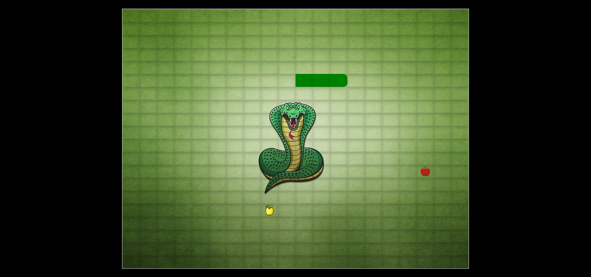

---

### 🐍 Snake Game – `README.md`

# 🐍 Snake Game

A fun and interactive web version of the classic Snake Game! Built using HTML, CSS, and JavaScript, this project features a dynamic grid, smooth movement, and both regular and golden food with unique effects.

---

## 🚀 Features

- 🎮 Smooth snake controls and movement
- ⭐ Golden food for bonus points and snake size reduce (BEST FEATURE)
- 📏 20x20 game grid (1200x600px)
- 🔄 Game reset and score tracking

---

## 🛠️ Tech Stack

- HTML5  
- CSS3  
- JavaScript (ES6)  

---

## Screenshots



## 🧪 Getting Started

```bash
git clone https://github.com/AyaanFarrukh/The-Snake-Game.git
cd Snake Game
open index.html in your browser
